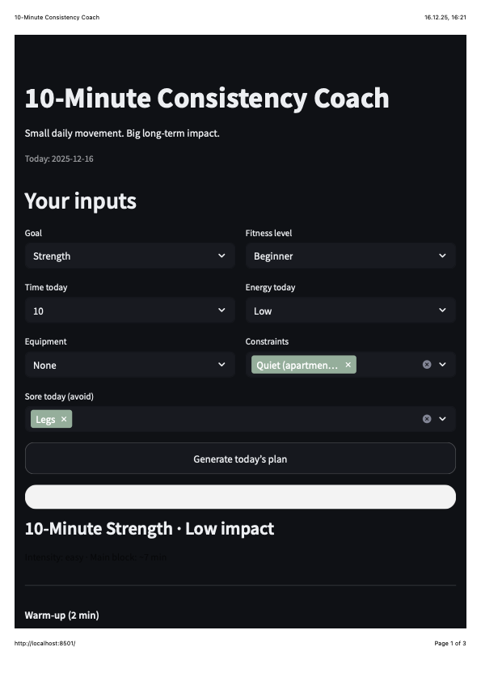

# 10-Minute Consistency Coach (Fitness Agent MVP)

A calm, minimal fitness-planning **agent** that generates a short daily workout plan (10–20 minutes) based on a user’s goal, energy level, available time, equipment, and constraints (e.g., knee pain, no jumping, soreness).

## Screenshot

### Generated plan (dark mode)



## Why I’m building this
Many fitness apps create friction: too many choices, too much time, and “commitment anxiety.”  
This MVP focuses on one job-to-be-done: **help a busy person decide “What should I do today?” in under 30 seconds** — safely and with low effort.

## Target user
- Busy adults (especially parents) with limited time (10–20 minutes)
- Beginners or returning to exercise
- People who prefer **low-impact / quiet (apartment-friendly)** options

## Problem statement
Users want an easy, safe way to choose a doable workout **today**, without searching videos, planning routines, or risking movements that don’t fit their body or energy.

## MVP scope (what it does)

### Inputs
- **Goal:** Strength / Mobility / Fat loss  
- **Time today:** 10 / 15 / 20 min  
- **Energy today:** Low / Normal / High  
- **Equipment:** None / Resistance band / Dumbbells  
- **Constraints:** Knee pain / Back pain / No jumping / Quiet (apartment-friendly)  
- **Sore today (avoid):** Chest/Shoulders / Legs / Core/Back

### Outputs
- A structured plan:
  - Warm-up (2 min)
  - Main block (~7–17 min)
  - Cool-down (1 min)
- **“Why this plan?”** (dynamic rationale showing the reasoning)
- Non-medical safety note
- Optional: download plan as TXT/JSON

## Example (Input → Output)

**Input**
- Goal: Strength
- Time: 10 min
- Energy: Low
- Equipment: None
- Constraints: Knee pain, Quiet (apartment-friendly)
- Sore today: Legs

**Output**
**Today’s plan · 10 min · Low impact**
- Warm-up (2 min): gentle march, shoulder rolls, hip hinges  
- Main (~7 min): wall push-ups, glute bridges, bird-dog, standing side leg raises  
- Cool-down (1 min): calf + hamstring stretch  
**Why this plan?** Low energy + knee-friendly + quiet + legs-sore adjustments.

## What makes this an “agent”
This is not just text generation. The agent:
1. **Reads context** (inputs + constraints + soreness)
2. **Applies decision logic** (filter / substitute movements)
3. **Generates a plan + rationale** (“Why this plan?”)

## What’s implemented
- Streamlit web app with dark, minimal UI
- Movement library with metadata (goal, impact, strain areas, equipment)
- Rule-based filtering and substitutions for safety and soreness
- Dynamic, explainable output via **“Why this plan?”**
- Optional plan download (TXT and JSON)
- Lightweight local metrics logging for plan generation events


## Agent Logic: Constraint Mapping (How Safety Works)
The agent uses rule-based filtering and substitution before formatting the final plan.

| Input | Filtering / Substitution |
|---|---|
| Knee pain | Avoid knee-strain movements (e.g., lunges); substitute safer alternatives |
| Back pain | Avoid back-strain options; substitute smaller-range core moves |
| No jumping / Quiet | Remove high-impact movements (e.g., burpees, jumping jacks) |
| Low energy | Prefer low-impact and simpler variations |
| Sore Chest/Shoulders | Avoid shoulder-heavy pushing; swap to gentle alternatives |
| Sore Legs | Avoid squat/lunge patterns; shift to mobility/upper body focus |
| Sore Core/Back | Avoid heavy core loading; choose gentle mobility |

## Success criteria (early)
- User can generate a safe plan in **< 30 seconds**
- Plan feels doable and clear (low friction)
- “Why this plan?” increases trust
- Repeated usage supports consistency

## Metrics (if this were a real product)
- **Activation:** plan generation rate per user/week  
- **Consistency (North Star):** % of users generating plans **≥ 5 days out of 7**  
- **Trust & Safety:** thumbs-down / “too hard / unsafe / irrelevant” rate  
- **Retention:** D7 / D30 returning users


## Run locally
```bash
pip install -r requirements.txt
streamlit run app.py


